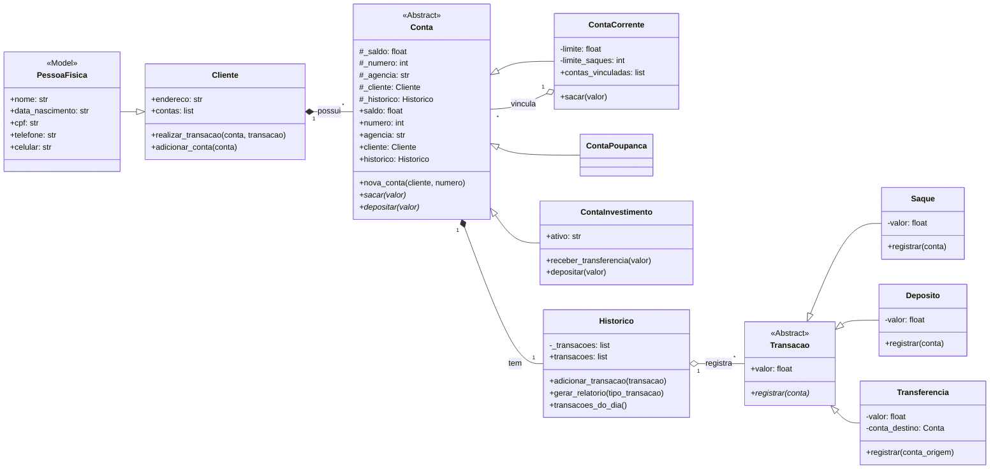

```mermaid
classDiagram
    direction LR

    class Cliente {
        +endereco: str
        +contas: list
        +realizar_transacao(conta, transacao)
        +adicionar_conta(conta)
    }

    class PessoaFisica {
        <<Model>>
        +nome: str
        +data_nascimento: str
        +cpf: str
        +telefone: str
        +celular: str
    }

    class Conta {
        <<Abstract>>
        #_saldo: float
        #_numero: int
        #_agencia: str
        #_cliente: Cliente
        #_historico: Historico
        +saldo: float
        +numero: int
        +agencia: str
        +cliente: Cliente
        +historico: Historico
        +nova_conta(cliente, numero)
        +sacar(valor)*
        +depositar(valor)*
    }

    class ContaCorrente {
        -limite: float
        -limite_saques: int
        +contas_vinculadas: list
        +sacar(valor)
    }

    class ContaPoupanca {
        
    }

    class ContaInvestimento {
        +ativo: str
        +receber_transferencia(valor)
        +depositar(valor)
    }

    class Historico {
        -_transacoes: list
        +transacoes: list
        +adicionar_transacao(transacao)
        +gerar_relatorio(tipo_transacao)
        +transacoes_do_dia()
    }

    class Transacao {
        <<Abstract>>
        +valor: float
        +registrar(conta)*
    }
    
    class Saque {
        -valor: float
        +registrar(conta)
    }

    class Deposito {
        -valor: float
        +registrar(conta)
    }

    class Transferencia {
        -valor: float
        -conta_destino: Conta
        +registrar(conta_origem)
    }

    PessoaFisica --|> Cliente
    Conta <|-- ContaCorrente
    Conta <|-- ContaPoupanca
    Conta <|-- ContaInvestimento
    Cliente "1" *-- "*" Conta : possui
    Conta "1" *-- "1" Historico : tem
    Historico "1" o-- "*" Transacao : registra
    Transacao <|-- Saque
    Transacao <|-- Deposito
    Transacao <|-- Transferencia
    ContaCorrente "1" o-- "*" Conta : vincula

```
