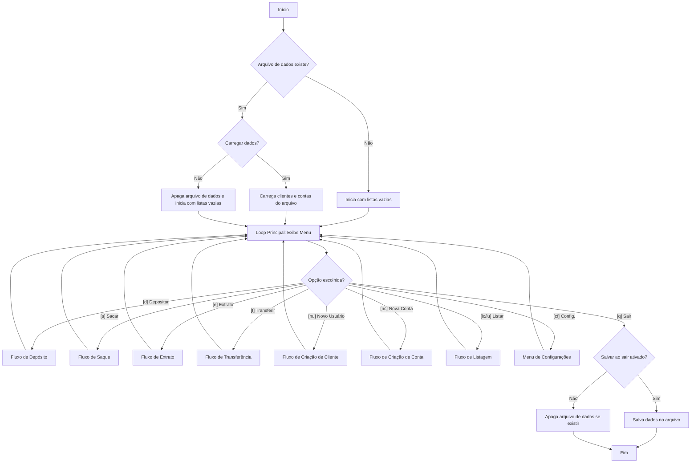

```mermaid
flowchart TD
    A[Início] --> B{Arquivo de dados existe?};
    B -- Sim --> C{Carregar dados?};
    B -- Não --> D[Inicia com listas vazias];
    C -- Sim --> E[Carrega clientes e contas do arquivo];
    C -- Não --> F[Apaga arquivo de dados e inicia com listas vazias];
    D --> G[Loop Principal: Exibe Menu];
    E --> G;
    F --> G;
    
    G --> H{Opção escolhida?};
    H -- [d] Depositar --> I[Fluxo de Depósito];
    H -- [s] Sacar --> J[Fluxo de Saque];
    H -- [e] Extrato --> K[Fluxo de Extrato];
    H -- [t] Transferir --> L[Fluxo de Transferência];
    H -- [nu] Novo Usuário --> M[Fluxo de Criação de Cliente];
    H -- [nc] Nova Conta --> N[Fluxo de Criação de Conta];
    H -- [lc/lu] Listar --> O[Fluxo de Listagem];
    H -- [cf] Config. --> P[Menu de Configurações];
    
    I --> G;
    J --> G;
    K --> G;
    L --> G;
    M --> G;
    N --> G;
    O --> G;
    P --> G;

    H -- [q] Sair --> Q{Salvar ao sair ativado?};
    Q -- Sim --> R[Salva dados no arquivo];
    Q -- Não --> S[Apaga arquivo de dados se existir];
    R --> T[Fim];
    S --> T;

```
